# Book Pocket Open

A local-first EPUB reader and audiobook studio. Read on iPhone, generate narration on your Windows PC, and keep your original books and audio.

**Development preview available:** [download the unsigned iPhone IPA (0.1.16)](https://github.com/mahmud-karim/BookPocket-Open/releases/download/v0.1.16-preview.1/BookPocketOpen.ipa) and [the compatible Windows installer (0.1.9)](https://github.com/mahmud-karim/BookPocket-Open/releases/download/windows-v0.1.9-preview.1/BookPocketOpen-Setup-x64.exe). Published downloads were retrieved and checksum-verified; [iPhone release notes](https://github.com/mahmud-karim/BookPocket-Open/releases/tag/v0.1.16-preview.1) and [Windows release notes](https://github.com/mahmud-karim/BookPocket-Open/releases/tag/windows-v0.1.9-preview.1) record their checks. The bottom menu now has **Library · Listen · Studio · Connection**. [Connection](docs/CONNECTION.md) verifies live PC access, keeps saved pairing when disconnected, and provides address editing and local forgetting. **Start companion** can launch an unavailable saved companion when the optional [Pocket Hub receiver](docs/COMPANION-START.md) is configured. An optional [Funnel connection](docs/FUNNEL.md) supports ordinary phone internet without a phone VPN. Existing paired phones can change to the public HTTPS address from **Connection → Edit connection details** while away from home.

Tap **Read aloud** in the reader to open its player and choose **On-device**, **Kyon**, or **Full cast**. Choose **Page** or **Chapter** for PC playback. **Saved audio** lists generated page clips even without a complete chapter, with original-text previews, durations and **Ready offline**/**On PC** status. Multiple matching takes require an explicit choice. PC voices require matching, verified downloaded audio before Play becomes available. The charcoal player extends to the screen bottom without a separate gray strip. See [Page audio](docs/PAGE-AUDIO.md). **Generate** asks for the current page or chapter and starts generation in the player; **Details** opens the exact original source preview. Listen keeps its controls on one screen with chapter selection and explicit alternate takes. See [the verification ledger](docs/VERIFICATION.md) for tested behavior and [the physical iPhone check](docs/DEVICE-CHECK.md) for the remaining device gates.

## Obsidian in the actual app

Simulator screenshots show the original public test book. These are rendered application screens, not design mockups.

<p>
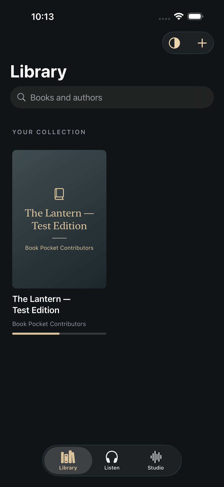
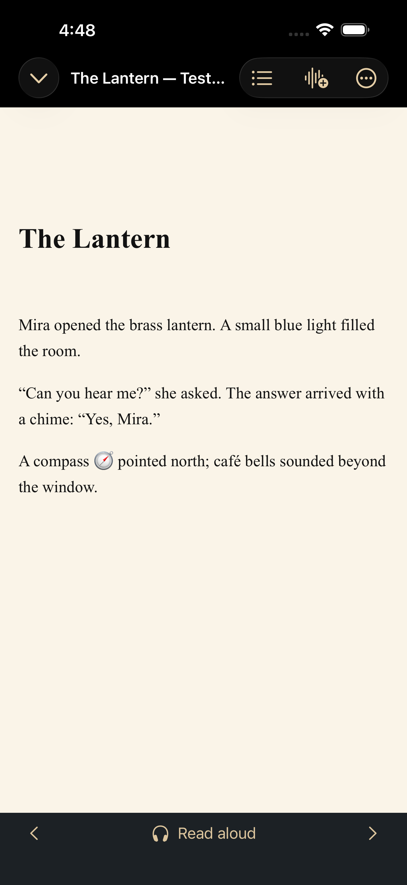
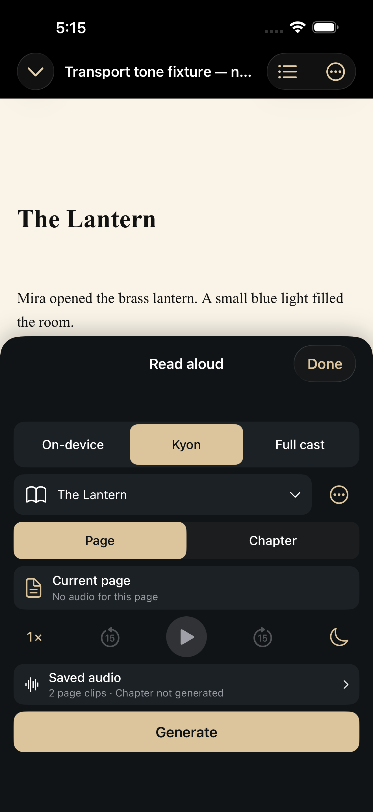
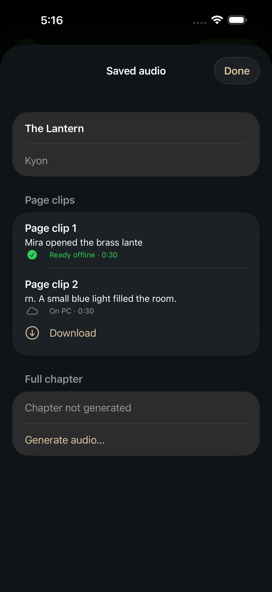
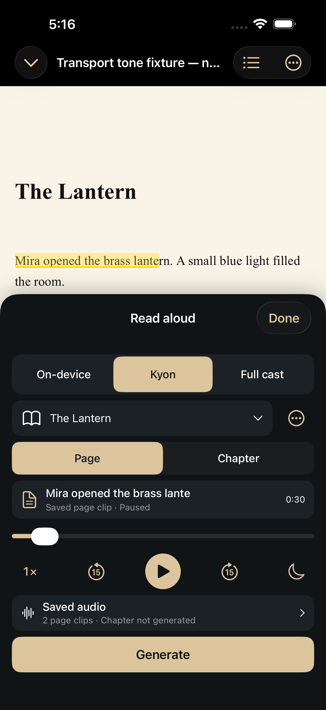
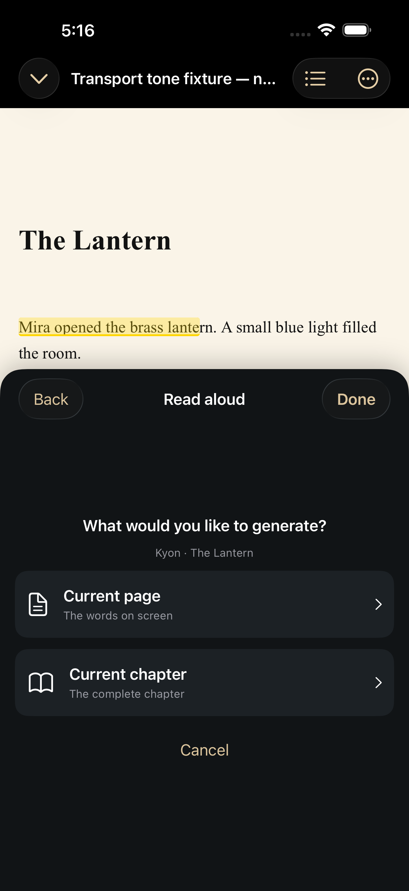
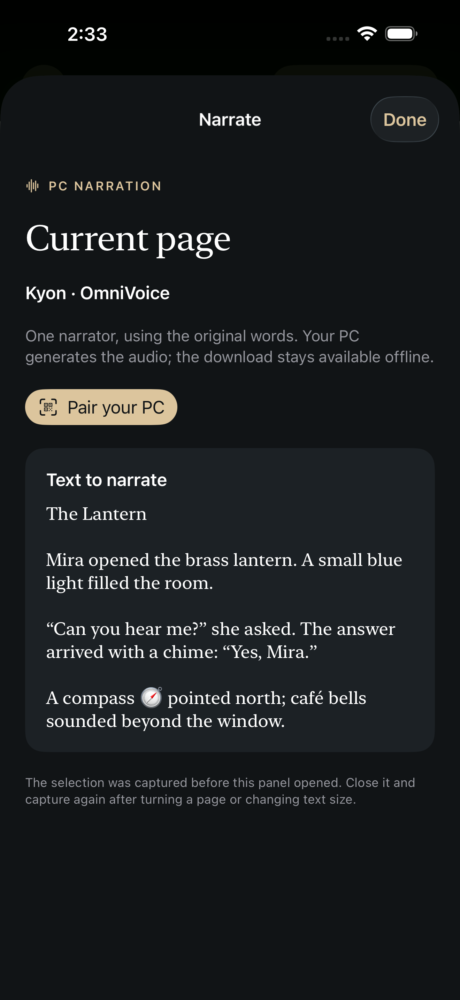
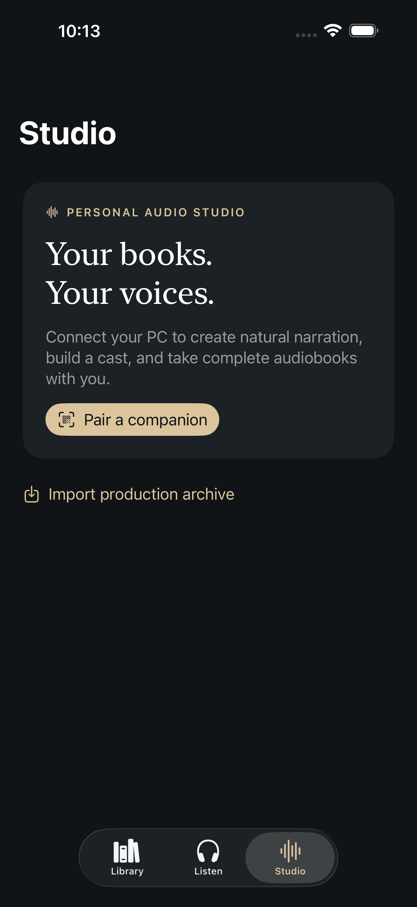
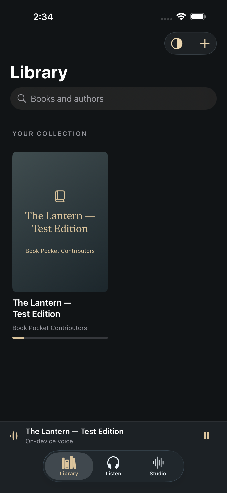
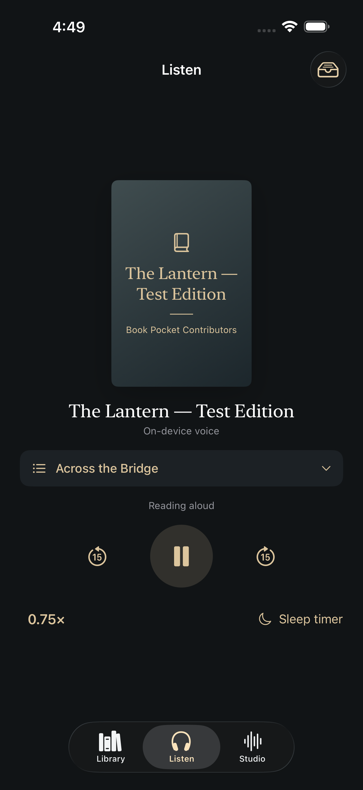
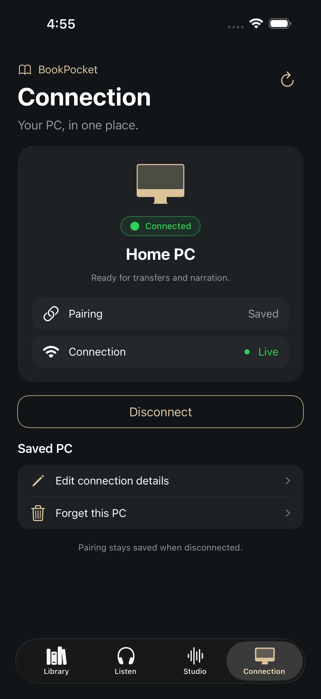
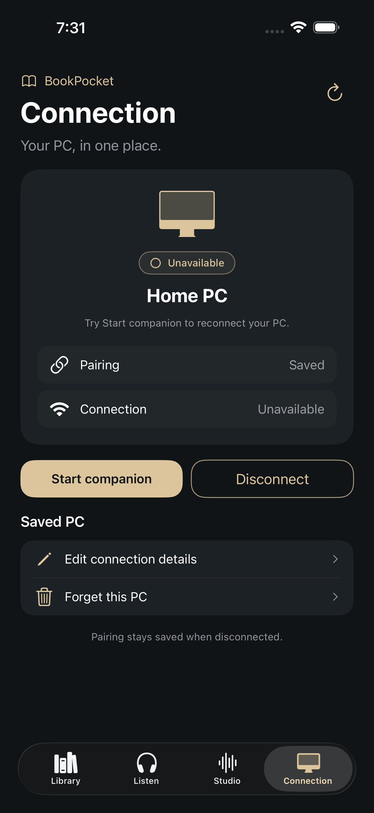
</p>

Generate starts preparation and generation after selecting page or chapter; the separate Details view retains the exact source preview. The screenshots use unpaired or isolated transport-fixture simulators, so they do not establish real phone generation. Offline player screenshots use explicitly labelled transport tones; these fixtures prove playback behavior, not narrator quality.

The integrated player also fits a [compact iPhone](docs/screenshots/ios-reader-player-compact.png). Largest-text checks show [the player](docs/screenshots/ios-reader-player-accessibility-compact.png), its [landscape layout](docs/screenshots/ios-reader-player-accessibility-compact-landscape.png), and the generation choices in [portrait](docs/screenshots/ios-reader-generate-accessibility-compact.png) and [landscape](docs/screenshots/ios-reader-generate-accessibility-compact-landscape.png).

Listen keeps its player controls on one screen, with a chapter selector and a tray for downloaded recordings. The [compact portrait](docs/screenshots/ios-listen-compact.png) and [landscape](docs/screenshots/ios-listen-landscape.png) screenshots show the same controls on an iPhone SE simulator.

The [downloaded chapter panel](docs/screenshots/ios-chapter-takes.png) and [compact panel](docs/screenshots/ios-chapter-takes-compact.png) show separately generated chapters and an alternate excerpt. These isolated offline playback tests use explicitly labelled non-speech tones, not a synthesized narrator.

The new [Connection tab](docs/CONNECTION.md) shows saved pairing separately from verified live access. Its [compact layout](docs/screenshots/ios-connection-compact.png) fits on one screen, [large accessibility text](docs/screenshots/ios-connection-accessibility-compact.png) can scroll to settings, and [active narration](docs/screenshots/ios-connection-playing.png) leaves all four tabs accessible. The connection-state screenshots use isolated transport fixtures, not a connection to a personal PC.

The [Start companion compact layout](docs/screenshots/ios-connection-start-compact.png) keeps Start, Disconnect, saved-PC actions and the footer above the menu without scrolling. A [failed-start fixture](docs/screenshots/ios-connection-start-failure-compact.png) shows an actionable message while retaining pairing. The receiver requires an awake, signed-in Windows PC with Pocket Hub and the public tunnel running; it does not wake an offline computer.

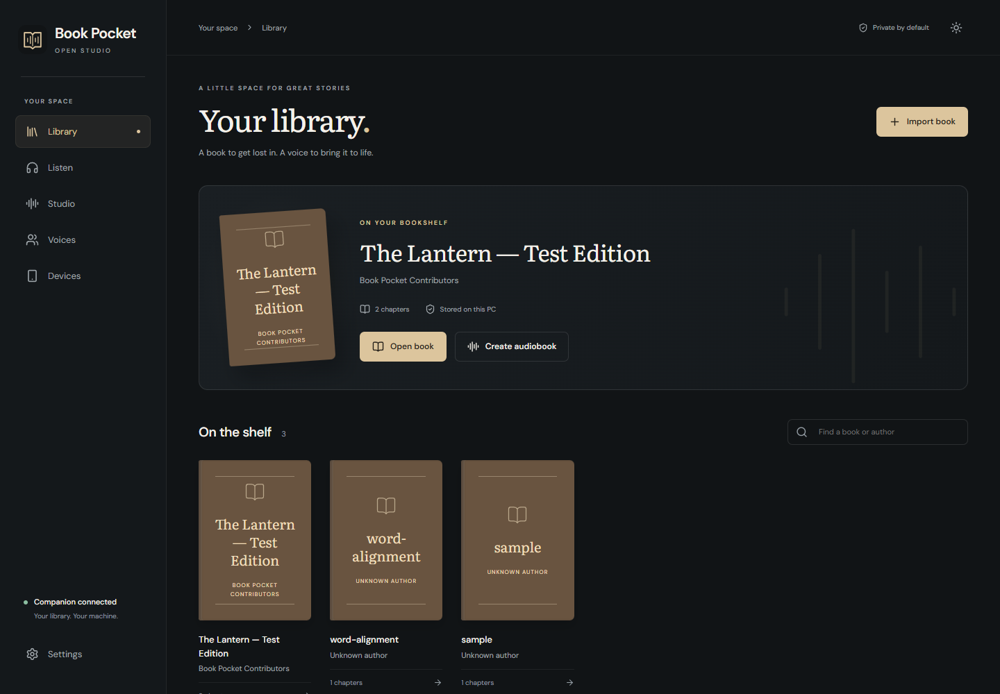

## The experience

- Native SwiftUI iOS reader using Readium: EPUB and text import, offline books, reading preferences, navigation, bookmarks, highlights, and Apple text-to-speech.
- Read and listen together: open the compact player from **Read aloud**, choose On-device, Kyon or Full cast, then press Play. Missing PC audio keeps playback disabled; Generate asks for page or chapter before capturing the source. Full cast uses saved, reviewed narrator/character assignments and stays distinct from single-voice Kyon takes.
- Preview the exact source text, follow durable PC generation, and download finished narration for offline playback. Pausing leaves manually chosen pages alone, and a late download cannot start after changing the selected narrator, take or page.
- Listen without scrolling; choose chapters for on-device reading or browse downloaded chapter recordings across the book. Alternate takes and excerpts remain explicit choices. Keep playback speed, sleep timer and transport controls together.
- Windows companion and an Obsidian desktop studio: local library, durable narration jobs, voice collection, device approval, and audio exports.
- Dedicated Connection tab with verified status, refresh, saved-pairing disconnect/reconnect, address editing, and offline local forgetting that retains books and downloaded narration.
- Managed Kokoro preset narration, Qwen3-TTS cloning, and [OmniVoice cloning](docs/OMNIVOICE.md), installed separately. OmniVoice runs inside the companion without VoiceStudio; its pretrained weights have noncommercial terms. An external VoiceStudio adapter remains optional.
- Full-cast narration from exact source passages, with editable voices and explicit review of model suggestions.
- No reading account. Original files, model runtimes, credentials, and audio stay outside the source checkout.

The interface uses charcoal, graphite, warm white, and restrained champagne accents, with coordinated light mode and independent reader backgrounds.

For profiles already created in a separate VoiceStudio installation, see [the connection and narration guide](docs/VOICE-STUDIO.md).

## Develop on Windows

Requirements: Python 3.11 or later, Node.js 22.12 or later, and FFmpeg/FFprobe on PATH for audio export. Model environments are separate from the application environment; their installers report actual readiness after a synthesis probe.

```powershell
python -m venv .venv
.\.venv\Scripts\python.exe -m pip install --require-hashes -r tests/requirements-test.lock -r scripts/build-requirements.lock
.\.venv\Scripts\python.exe -m pip install --no-deps --no-build-isolation -e './companion'
cd studio
npm ci
npm run build
cd ..
.\.venv\Scripts\bookpocket.exe serve --tray
```

The launcher opens the authenticated studio on loopback HTTP port 8782. The phone endpoint uses HTTPS on port 8783 with a locally generated certificate pinned during pairing. Keep the studio launcher link private. Pairings require approval on the PC. Use `--public-url https://YOUR-PC:8783` when automatic LAN address selection does not match the network your phone uses.

For UI development, run `npm run dev` in `studio` and launch the companion in development mode on the proxy port:

```powershell
.\.venv\Scripts\bookpocket.exe serve --dev --port 8782
```

Development mode is loopback-only. Open the studio with the launcher's session credential; do not place it in source files, screenshots, or issue reports.

```powershell
.\.venv\Scripts\python.exe -m pytest companion/tests tests
cd studio
npm test
npm run build
```

## iOS builds

The native app targets iOS 18+. On a Mac with Xcode and XcodeGen, run `xcodegen generate` in `ios`, open `BookPocketOpen.xcodeproj`, and select the `BookPocketOpen` scheme. GitHub Actions runs simulator tests before creating a verified unsigned iPhoneOS ARM64 IPA. Unsigned packages require a compatible sideloading workflow; they are not App Store installations. Physical iPhone playback and sideload checks are recorded separately from CI.

## Architecture and scope

[Product plan](docs/PRODUCT.md) · [API contract](docs/CONTRACT.md) · [Verification](docs/VERIFICATION.md)

Text identities refer to immutable source passages. Font changes and pagination do not change narration identities. Pronunciation substitutions affect synthesis only. Jobs persist in SQLite and cache individual passages so retries can reuse completed audio. Speech timing precision is explicitly reported; sentence timings are not represented as word alignment.

## License

Original project code is Apache-2.0. Dependencies and model weights keep their own licenses; see [NOTICE](NOTICE). Model downloads are optional and are not included in this repository. The synthetic test book is original project fixture text. Voice references and books must be supplied by the user.
